# Rotary-Inverted-Pendulum-Swing-Up-and-Stabilization
Swing Up and Stabilization (through LQR or SMC) of a Rotary Inverted Pendulum.

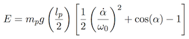
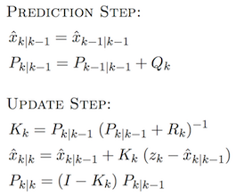
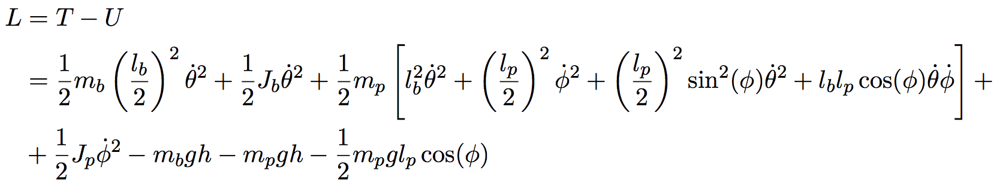
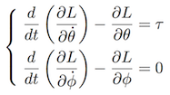
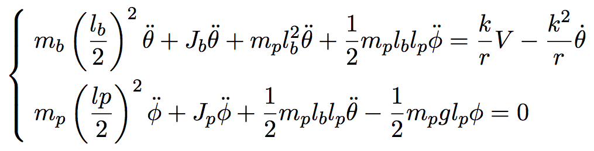
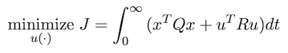
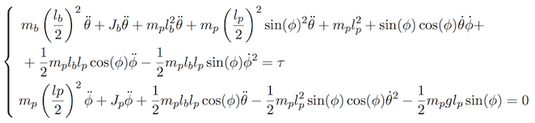
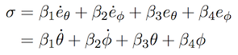
!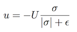
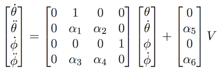
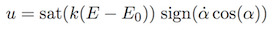
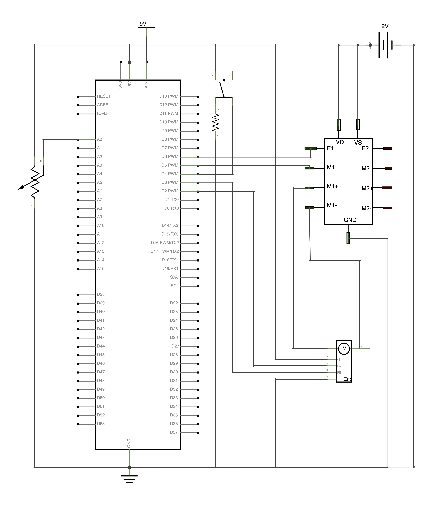


## Running

Upload code on board with:
```
arduino --upload main.ino
```

## References
- [Kalman Filter](https://en.wikipedia.org/wiki/Kalman_filter)
- [Linear Quadratic Regulator](https://en.wikipedia.org/wiki/Linear–quadratic_regulator)
- [Sliding Mode Control](https://en.wikipedia.org/wiki/Sliding_mode_control)
